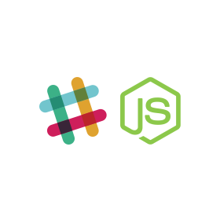

# Slack NodeJS BOT

A NodeJS Slack BOT boilerplate using [BotKit](https://github.com/howdyai/botkit).



> There's no `npm install` for this, you need to clone/fork this repo and use as you want.

## Docker

This project is ready to be used with docker, there's a `Dockerfile` and you can edit as you want.

If you want to enter in the container to run, just type `./bin/run_dev` and you'll enter in the container :tada:

## Environment

You just need to set the `SLACK_TOKEN` environment variable.

If you don't have this token you'll create a bot in your slack workspace, you can use this url:  [https://your_workspace.slack.com/apps/new/A0F7YS25R-bots](https://your_workspace.com/apps/new/A0F7YS25R-bots) (don't forget to change the `your_workspace`).


## Chatbot

To insert new slack commands to the chatbot you just need to create a new file located at `communication/`. This file must be a class that extends the `Communication` class (available in the `communication/index.js`).

There's a default command called `help` that will list all the available commands and their description.

> You can ask `who are you?` to bot and see an example communication.

Example: 

```
const Communication = require('./')

class WhoAreYou extends Communication {
  constructor (...args) {
    super(args)
    this.hears = [ 'who are you?$' ]
    this.example = 'hi, who are you?'
    this.description = 'This command ask to the bot who it is'
    this.types = 'direct_message,direct_mention,mention'
  }

  async answer (bot, message) {
    bot.reply(message, ':robot_face: Hello human! I think that the right question is who are YOU? :thinking:')
  }
}

module.exports = WhoAreYou
```

#### Communication Class Details


|Property|Description|Example|
|------------|---------------|-------------|
|.hears|Array of Strings (or RegExp)|`['who are you$']`|
|.example|String with a use example|`'hi, who are you?'`|
|.description|String with a command description, helpful in the `help` command|`'This command ask to the bot who it is'`|
|.types|String with message types separated with comma|`direct_message,direct_mention,mention`

## Contribute

Feel free to contribute as you want, any help you be welcome :smile: